# 🕹️ ViZDoom + Gymnasium no WSL (Windows)

Este projeto utiliza o [ViZDoom](https://vizdoom.farama.org/) em conjunto com o [Gymnasium](https://gymnasium.farama.org/) para testar e treinar agentes em ambientes do clássico jogo Doom. O ambiente está configurado para rodar no **WSL (Windows Subsystem for Linux)**.

---

## 🧬 Algoritmo Genético aplicado ao ViZDoom
Este projeto utiliza um algoritmo genético para treinar um agente a jogar Doom. Abaixo estão os principais componentes do processo evolutivo:

**1. O que está sendo otimizado?**

Otimiza os pesos e biases de uma rede neural simples. Essa rede neural funciona como o "cérebro" do agente, recebendo informações do estado do jogo (como vida, munição, posição de inimigos) em tempo real e decidindo qual ação tomar a cada momento. O objetivo é evoluir um cérebro que maximize o desempenho no jogo.

**2. Representação da solução (genoma)**

Um vetor (array NumPy) de números de ponto flutuante que representa todos os pesos e biases da rede neural, concatenados em uma única estrutura de dados.

**3. Função de fitness**

A função de fitness, presente no arquivo game_interface.py, é uma fórmula complexa que recompensa e penaliza várias ações para medir o desempenho de um indivíduo em um episódio. A fórmula é:

>Fitness Base = (6.0 * Kills) + (1.0 * Vida) + (0.4 * Munição) + (0.5 * Itens Coletados) + (1.0 * Dano Causado) - (0.5 * Dano Recebido) - (0.5 * Tiros Errados) + (3.0 * Progresso no Mapa)

Além disso, o agente recebe um bônus de fitness significativo ao cruzar checkpoints pré-definidos no mapa, incentivando a exploração e o avanço.

**4. Método de seleção**

O método utilizado é a Seleção por Torneio. Um número específico de indivíduos (TOURNAMENT_SIZE) é selecionado aleatoriamente da população, e o que possuir o maior fitness entre eles é escolhido como "pai" para a próxima geração.

**5. Crossover**

O código utiliza o Blended Crossover. Neste método, os genomas (vetores de pesos) de dois pais são combinados através de uma mistura ponderada. Para cada peso, um fator de mistura aleatório é gerado, e o novo peso do filho é uma combinação linear dos pesos dos pais, permitindo a criação de características intermediárias.

**6. Inicialização**

A população inicial é criada gerando-se, para cada indivíduo, um genoma (vetor de pesos) com valores aleatórios amostrados de uma distribuição normal padrão. Isso significa que a primeira geração é composta por "cérebros" completamente aleatórios.

**7. Critério de parada**

O algoritmo para quando não há uma melhoria significativa no fitness do melhor indivíduo por um número definido de gerações (STAGNATION_LIMIT). Uma melhoria só é considerada "significativa" se for maior que um limiar pré-definido (IMPROVEMENT_THRESHOLD).

---

## 🧬 Explicação do Funcionamento do Algoritmo

Este projeto utiliza um algoritmo genético para treinar um agente autônomo a jogar Doom. O diferencial desta abordagem é que não evoluímos uma sequência fixa de movimentos, mas sim o cérebro do agente, que é uma rede neural. Este cérebro aprende a tomar decisões em tempo real com base no que "vê" no jogo.

O processo evolutivo, ilustrado pelo fluxograma abaixo, permite que o agente aprimore suas estratégias de combate e sobrevivência ao longo de várias gerações.

```mermaid
architecture-beta
    service user(mdi:account)
    service lambda(logos:aws-lambda)

    user:R --> L:lambda
```



---

## ✅ Pré-requisitos

- **Windows 10 ou 11 com WSL2**
- **Ubuntu instalado no WSL**
- **Python 3.8 ou superior** (use `venv` de preferência)

> ℹ️ Caso ainda não tenha o WSL configurado, siga a [documentação oficial da Microsoft](https://learn.microsoft.com/windows/wsl/install).

---

## ⚙️ Instalação do ambiente no Ubuntu (WSL)

Execute os comandos abaixo no terminal Ubuntu (WSL):

### 1. Atualize os pacotes e instale as dependências

```bash
sudo apt update
sudo apt install -y build-essential cmake git \
    libsdl2-dev libboost-all-dev libopenal-dev \
    python3-dev python3-pip
```

### 2. Crie um ambiente virtual

```bash
python3 -m venv .venv
source .venv/bin/activate
```

### 3. Instale o ViZDoom diretamente do repositório

```bash
pip install git+https://github.com/Farama-Foundation/ViZDoom
```

### 4. Instale o Gymnasium

```bash
pip install gymnasium
```

# Citação

> M Wydmuch, M Kempka & W Jaśkowski, ViZDoom Competitions: Playing Doom from Pixels, IEEE Transactions on Games, vol. 11, no. 3, pp. 248-259, 2019
([arXiv:1809.03470](https://arxiv.org/abs/1809.03470))
```
@article{Wydmuch2019ViZdoom,
  author  = {Marek Wydmuch and Micha{\l} Kempka and Wojciech Ja\'skowski},
  title   = {{ViZDoom} {C}ompetitions: {P}laying {D}oom from {P}ixels},
  journal = {IEEE Transactions on Games},
  year    = {2019},
  volume  = {11},
  number  = {3},
  pages   = {248--259},
  doi     = {10.1109/TG.2018.2877047},
  note    = {The 2022 IEEE Transactions on Games Outstanding Paper Award}
}
```

or/and

> M. Kempka, M. Wydmuch, G. Runc, J. Toczek & W. Jaśkowski, ViZDoom: A Doom-based AI Research Platform for Visual Reinforcement Learning, IEEE Conference on Computational Intelligence and Games, pp. 341-348, Santorini, Greece, 2016	([arXiv:1605.02097](http://arxiv.org/abs/1605.02097))
```
@inproceedings{Kempka2016ViZDoom,
  author    = {Micha{\l} Kempka and Marek Wydmuch and Grzegorz Runc and Jakub Toczek and Wojciech Ja\'skowski},
  title     = {{ViZDoom}: A {D}oom-based {AI} Research Platform for Visual Reinforcement Learning},
  booktitle = {IEEE Conference on Computational Intelligence and Games},
  year      = {2016},
  address   = {Santorini, Greece},
  month     = {Sep},
  pages     = {341--348},
  publisher = {IEEE},
  doi       = {10.1109/CIG.2016.7860433},
  note      = {The Best Paper Award}
}
```